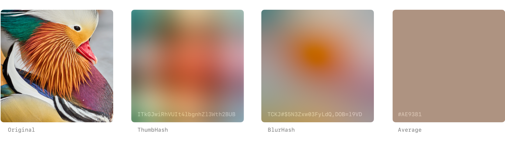
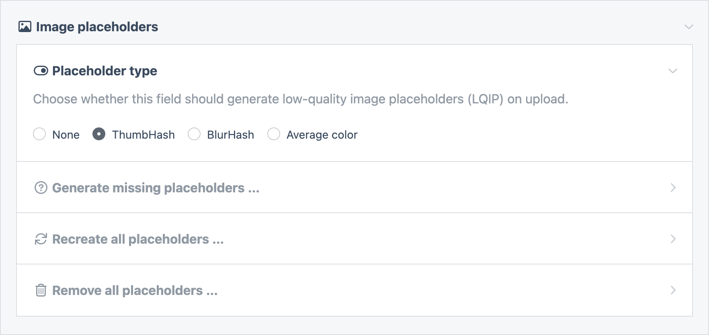

# ProcessWire Image Placeholders

**A ProcessWire module to generate image placeholders for smoother lazyloading.**

Supports [ThumbHash](https://evanw.github.io/thumbhash/), [BlurHash](https://blurha.sh/), and
average color placeholders.



## Why use image placeholders?

Low-Quality Image Placeholders (LQIP) are used to improve the perceived performance of sites by
displaying a **small, low-quality version of an image** while the high-quality version is being loaded.
The LQIP technique is often used in combination with progressive lazyloading.

## How it works

This module will automatically generate a small blurry image placeholder for each image that is
uploaded to fields configured to use them. In your frontend templates, you can access the image
placeholder as a data URI string to display while the high-quality image is loading.
See below for markup examples.

## Placeholder types

The module supports generating various types of image placeholders. The default is `ThumbHash`.

### ThumbHash

[ThumbHash](https://evanw.github.io/thumbhash/) is a newer algorith with improved color rendering
and support for transparency.

### BlurHash

[BlurHash](https://blurha.sh/) is the original placeholder algorithm, developed at Wolt. It
currently has no support for alpha channels and will render transparency in black.

### Average color

Calculates the average color of the image.

## Installation

Install the module using composer from the root of your ProcessWire installation.

```sh
composer require daun/processwire-image-placeholders
```

Open the admin panel of your site and navigate to `Modules` → `Site` → `ImagePlaceholders` to finish installation.

## Configuration

You'll need to configure your image fields to generate image placeholders.

`Setup` → `Fields` → `[images]` → `Details` → `Image placeholders`

There, you can choose the type of placeholder to generate. If you're installing the module on an
existing site, you can also choose to batch-generate placeholders for any existing images.



## Usage

Accessing an image's `lqip` property will return a data URI string of its placeholder.

```php
$page->image->lqip; // data:image/png;base64,R0lGODlhEAAQAMQAA
```

Accessing it as a method allows setting a custom width and/or height of the placeholder.

```php
$page->image->lqip(300, 200); // 300x200px
```

### Markup

Using a lazyload library like [lazysizes](https://github.com/aFarkas/lazysizes) or
[vanilla-lazyload](https://github.com/verlok/vanilla-lazyload), you can show a
placeholder image by using its data URI as `src` of the image.

```php
<!-- Using the placeholder as src while lazyloading the image -->
image->lqip ?>"
  data-src="<?= $page->image->url ?>"
  data-lazyload
/>
```

Another technique is rendering the placeholder and the original image as separate images on top of
each other. This allows smoother animations between the blurry unloaded and the final loaded state.

```php
<!-- Display placeholder and image on top of each other -->
<div class="ratio-box">
  image->lqip ?>" aria-hidden="true">
  image->url ?>" data-lazyload>
</div>
```

## Support

Please [open an issue](https://github.com/daun/processwire-image-placeholders/issues/new) for support.

## License

[MIT](./LICENCE)
